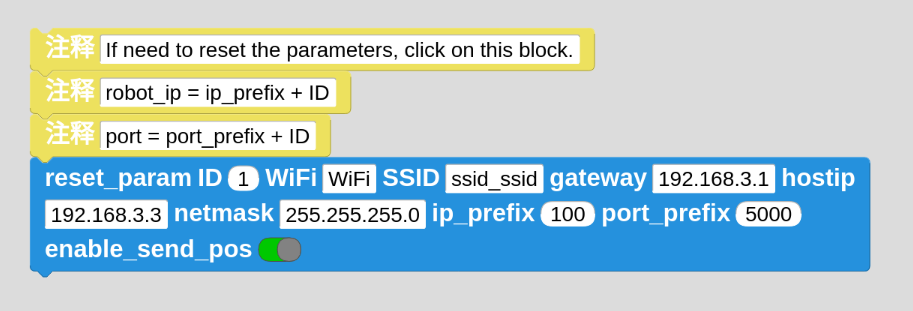

## CoCube_UDP
基于MicroBlocks固件，CoCube与上位机UDP通信的接口

## CoCube固件

通过MicroBlocks IDE，给CoCube烧录最新的固件程序。
https://microblocksfun.cn/run/microblocks.html

## CoCube驱动程序

通过MicroBlocks IDE，给CoCube上传一个UDP通信的程序。

位于"文件->打开->示例->by board->CoCube->CoCube_server_udp"

第一次使用时，需要输入一些配置参数，包含机器人ID、WiFi及密码、网关IP地址、上位机IP地址、IP前缀等信息。

配置完成后，点击该积木块后，点击右上角绿色的"运行"按键即可。

## CoCube上位机程序

本仓库cocube_udp目录下，为上位机程序。

注意：请确保上位机和CoCube之间可以正常通信，如无法正常通信，请检查是否开启网络代理软件。

## License
`cocube` is distributed under the terms of the [MIT](https://spdx.org/licenses/MIT.html) license.